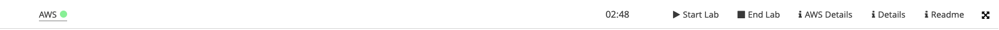
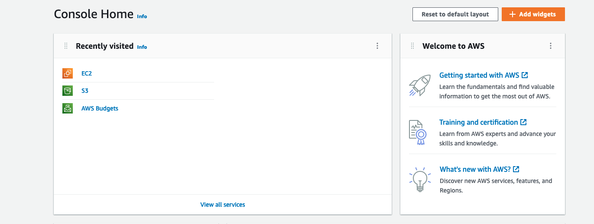
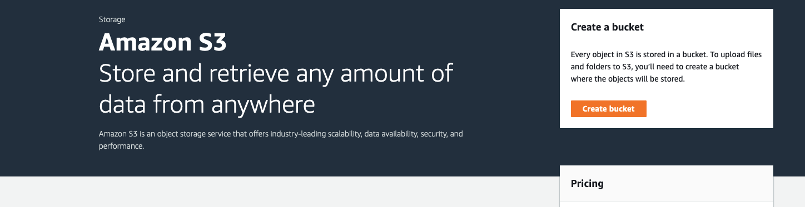
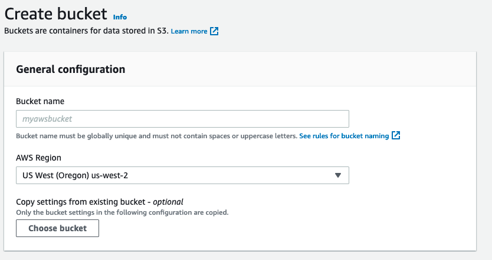

# Solution Friday 22-09-30

## First Exercise : Upload static Website via Console

### 1. Start your Sandbox 

You klick on that in Modules

____________________________

Than you Start the Lab and wait so long the point next to AWS is green not red or yellow

____________________________

### 2. Create a new S3 Bucket

After AWS lamp is green you click on AWS

____________________________________

Now you click on S3. 

Little Info: You find that by me under Recently visited because i have use it recently

_____________________________________

You click on New bucket on the right site

__________________________________

Now you change the name of the bucket like " Lettuce" or other is your own choice not specified.
And change the region to your own Region
Than you scroll down and create the bucket on the button create bucket :D

